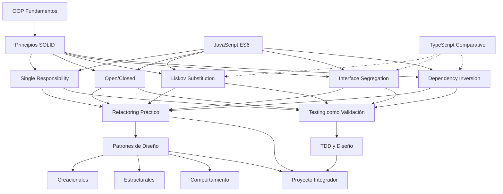

# ARQUITECTURA CURRICULAR: SOLID APLICADO EN JAVASCRIPT

## METADATA

- **Complejidad**: Media
- **Duración estimada**: 105 horas (aplicando factor 1.5 de subcompensación cognitiva)
- **Audiencia objetivo**: Desarrolladores y técnicos con experiencia en programación orientada a objetos
- **Prerrequisitos obligatorios**:
  1. Programación Orientada a Objetos (clases, herencia, polimorfismo, encapsulación)
  2. Experiencia práctica con al menos un lenguaje OOP (Java, C#, JavaScript, Python, TypeScript)
  3. Conocimientos básicos de patrones de diseño
  4. Comprensión de testing unitario
- **Fecha de diseño**: 2025-12-07

## MAPA CONCEPTUAL



## OBJETIVOS GENERALES DEL CURSO

1. **Aplicar los cinco principios SOLID** en arquitecturas JavaScript reales, identificando violaciones y ejecutando refactorizaciones medibles que mejoren métricas de acoplamiento y cohesión.

2. **Diseñar sistemas extensibles y mantenibles** utilizando patrones de diseño que implementen principios SOLID, justificando decisiones arquitectónicas mediante análisis de trade-offs.

3. **Validar la calidad del diseño** mediante testing unitario y TDD, demostrando cómo el cumplimiento de SOLID facilita la testabilidad y reduce la deuda técnica.

4. **Evaluar arquitecturas de código** existentes, diagnosticando anti-patrones y code smells relacionados con violaciones SOLID, proponiendo planes de refactorización priorizados.

5. **Integrar principios SOLID en el ciclo completo de desarrollo**, desde el diseño inicial hasta el mantenimiento evolutivo, aplicando refactoring continuo y arquitectura emergente.

## ESTRUCTURA MODULAR

### MÓDULO 0: Diagnóstico y Fundamentos OOP en JavaScript

**Duración**: 6 horas
**Objetivo**: Validar dominio de OOP en JavaScript ES6+ y nivelar conocimientos sobre clases, prototipos y testing

#### Ruta Básica

- **Subtema 0.1.1**: Clases y Prototipos en JavaScript
  - Objetivo específico: Implementar clases ES6+ con herencia y polimorfismo, explicando diferencias con prototipos
  - Tiempo estimado: 45 minutos
  - Tipo: Mixto
  - Requiere Código: Sí

- **Subtema 0.1.2**: Composición vs Herencia
  - Objetivo específico: Comparar soluciones basadas en herencia vs composición, identificando trade-offs
  - Tiempo estimado: 45 minutos
  - Tipo: Práctico
  - Requiere Código: Sí

- **Subtema 0.2.1**: Testing Unitario con Jest/Vitest
  - Objetivo específico: Escribir tests unitarios con mocks y stubs para validar comportamiento aislado
  - Tiempo estimado: 60 minutos
  - Tipo: Práctico
  - Requiere Código: Sí

- **Subtema 0.2.2**: Code Smells Básicos
  - Objetivo específico: Identificar Long Method, Large Class, Feature Envy en código JavaScript
  - Tiempo estimado: 45 minutos
  - Tipo: Teórico-Práctico
  - Requiere Código: No

- **Subtema 0.3.1**: Métricas de Calidad (Cohesión y Acoplamiento)
  - Objetivo específico: Calcular métricas de acoplamiento aferente/eferente y cohesión LCOM
  - Tiempo estimado: 45 minutos
  - Tipo: Teórico
  - Requiere Código: No

- **Subtema 0.4.1**: Evaluación Diagnóstica
  - Objetivo específico: Resolver ejercicio integrador que valide OOP, testing y detección de smells
  - Tiempo estimado: 90 minutos
  - Tipo: Práctica
  - Requiere Código: Sí

#### Ruta Intermedia

- **Subtema 0.1.1**: Clases y Prototipos en JavaScript (Revisión rápida 20 min)
- **Subtema 0.2.1**: Testing Unitario con Jest/Vitest (Revisión rápida 30 min)
- **Subtema 0.2.2**: Code Smells Básicos (45 min)
- **Subtema 0.3.1**: Métricas de Calidad (45 min)
- **Subtema 0.4.1**: Evaluación Diagnóstica (60 min)

**Duración Ruta Intermedia**: 3.5 horas

#### Ruta Avanzada

- **Subtema 0.2.2**: Code Smells Básicos (30 min revisión acelerada)
- **Subtema 0.3.1**: Métricas de Calidad (30 min)
- **Subtema 0.4.1**: Evaluación Diagnóstica (45 min)

**Duración Ruta Avanzada**: 2 horas

---

### MÓDULO 1: Single Responsibility Principle (SRP)

**Duración**: 12 horas
**Objetivo**: Diseñar clases con responsabilidad única, identificando violaciones mediante análisis de cohesión y ejecutando refactorizaciones que aumenten mantenibilidad

#### TEMA 1.1: Fundamentos del SRP

**Objetivo del Tema**: Comprender el principio de responsabilidad única y su impacto en cohesión

- **Subtema 1.1.1**: Definición y Fundamentos del SRP
  - Objetivo: Explicar el SRP con ejemplos de "razones para cambiar" en clases JavaScript
  - Tipo: Teoría
  - Requiere Código: No
  - Tiempo: 30 min

- **Subtema 1.1.2**: Cohesión y SRP
  - Objetivo: Calcular métricas LCOM para identificar clases con baja cohesión
  - Tipo: Práctica
  - Requiere Código: Sí
  - Tiempo: 45 min

- **Subtema 1.1.3**: Violaciones Comunes del SRP
  - Objetivo: Identificar God Objects, clases con múltiples responsabilidades en código real
  - Tipo: Práctica
  - Requiere Código: Sí
  - Tiempo: 45 min

#### TEMA 1.2: Refactoring hacia SRP

**Objetivo del Tema**: Aplicar técnicas de refactoring para lograr responsabilidad única

- **Subtema 1.2.1**: Extract Class
  - Objetivo: Refactorizar clases complejas extrayendo responsabilidades a nuevas clases
  - Tipo: Práctica
  - Requiere Código: Sí
  - Tiempo: 90 min

- **Subtema 1.2.2**: Extract Method
  - Objetivo: Dividir métodos largos en métodos pequeños con responsabilidad única
  - Tipo: Práctica
  - Requiere Código: Sí
  - Tiempo: 60 min

- **Subtema 1.2.3**: Move Method/Field
  - Objetivo: Reubicar métodos y atributos en las clases correctas según responsabilidad
  - Tipo: Práctica
  - Requiere Código: Sí
  - Tiempo: 60 min

#### TEMA 1.3: SRP en Arquitecturas JavaScript

**Objetivo del Tema**: Aplicar SRP en contextos específicos de JavaScript moderno

- **Subtema 1.3.1**: SRP en Controladores y Servicios
  - Objetivo: Separar lógica de presentación, negocio y acceso a datos en aplicaciones Node.js
  - Tipo: Práctica
  - Requiere Código: Sí
  - Tiempo: 90 min

- **Subtema 1.3.2**: SRP en Componentes React/Vue
  - Objetivo: Diseñar componentes con responsabilidad única, evitando componentes God
  - Tipo: Práctica
  - Requiere Código: Sí
  - Tiempo: 90 min

- **Subtema 1.3.3**: Testing de Clases SRP-Compliant
  - Objetivo: Escribir tests unitarios que validen responsabilidad única mediante mocks mínimos
  - Tipo: Práctica
  - Requiere Código: Sí
  - Tiempo: 90 min

#### TEMA 1.4: Ejercicio Integrador SRP

**Objetivo del Tema**: Refactorizar sistema violador de SRP aplicando todas las técnicas aprendidas

- **Subtema 1.4.1**: Proyecto: Sistema de Facturación con SRP
  - Objetivo: Refactorizar sistema de facturación monolítico separando responsabilidades
  - Tipo: Proyecto
  - Requiere Código: Sí
  - Tiempo: 180 min

**Duración Total Módulo 1**: 12 horas

---

### MÓDULO 2: Open/Closed Principle (OCP)

**Duración**: 14 horas
**Objetivo**: Diseñar sistemas extensibles sin modificar código existente, aplicando polimorfismo y patrones estrategia/template

#### TEMA 2.1: Fundamentos del OCP

**Objetivo del Tema**: Comprender el principio abierto/cerrado y sus mecanismos de implementación

- **Subtema 2.1.1**: Definición y Motivación del OCP
  - Objetivo: Explicar OCP mediante casos de modificación en cascada vs extensión
  - Tipo: Teoría
  - Requiere Código: No
  - Tiempo: 30 min

- **Subtema 2.1.2**: Polimorfismo como Mecanismo OCP
  - Objetivo: Implementar extensiones mediante herencia y composición polimórfica
  - Tipo: Práctica
  - Requiere Código: Sí
  - Tiempo: 90 min

- **Subtema 2.1.3**: Abstracciones Estables
  - Objetivo: Diseñar interfaces abstractas resistentes al cambio usando principios de estabilidad
  - Tipo: Teórico-Práctico
  - Requiere Código: Sí
  - Tiempo: 60 min

#### TEMA 2.2: Patrones de Diseño OCP

**Objetivo del Tema**: Aplicar patrones que implementan OCP en JavaScript

- **Subtema 2.2.1**: Strategy Pattern
  - Objetivo: Implementar familia de algoritmos intercambiables usando Strategy en JS
  - Tipo: Práctica
  - Requiere Código: Sí
  - Tiempo: 90 min

- **Subtema 2.2.2**: Template Method Pattern
  - Objetivo: Definir esqueleto de algoritmo permitiendo extensión de pasos específicos
  - Tipo: Práctica
  - Requiere Código: Sí
  - Tiempo: 90 min

- **Subtema 2.2.3**: Decorator Pattern
  - Objetivo: Añadir comportamiento dinámicamente sin modificar clases existentes
  - Tipo: Práctica
  - Requiere Código: Sí
  - Tiempo: 90 min

#### TEMA 2.3: OCP en JavaScript Moderno

**Objetivo del Tema**: Aplicar OCP usando características ES6+ y frameworks

- **Subtema 2.3.1**: Plugins y Middleware
  - Objetivo: Diseñar sistemas de plugins extensibles en Express/Koa
  - Tipo: Práctica
  - Requiere Código: Sí
  - Tiempo: 90 min

- **Subtema 2.3.2**: Higher-Order Functions y OCP
  - Objetivo: Usar funciones de orden superior para extensibilidad funcional
  - Tipo: Práctica
  - Requiere Código: Sí
  - Tiempo: 60 min

- **Subtema 2.3.3**: Configuration Objects
  - Objetivo: Diseñar APIs extensibles mediante objetos de configuración
  - Tipo: Práctica
  - Requiere Código: Sí
  - Tiempo: 60 min

#### TEMA 2.4: Ejercicio Integrador OCP

**Objetivo del Tema**: Extender sistema existente sin modificar código base

- **Subtema 2.4.1**: Proyecto: Sistema de Reportes Extensible
  - Objetivo: Añadir nuevos formatos de reporte sin modificar generador base
  - Tipo: Proyecto
  - Requiere Código: Sí
  - Tiempo: 180 min

**Duración Total Módulo 2**: 14 horas

---

### MÓDULO 3: Liskov Substitution Principle (LSP)

**Duración**: 13 horas
**Objetivo**: Diseñar jerarquías de herencia que respeten contratos, evitando violaciones LSP mediante precondiciones, postcondiciones e invariantes

#### TEMA 3.1: Fundamentos del LSP

**Objetivo del Tema**: Comprender sustitución de Liskov y contratos comportamentales

- **Subtema 3.1.1**: Definición y Contratos
  - Objetivo: Explicar LSP mediante análisis de precondiciones/postcondiciones/invariantes
  - Tipo: Teoría
  - Requiere Código: No
  - Tiempo: 45 min

- **Subtema 3.1.2**: Violaciones Clásicas de LSP
  - Objetivo: Identificar violaciones: Square/Rectangle, refusing bequest, throwing exceptions
  - Tipo: Teórico-Práctico
  - Requiere Código: Sí
  - Tiempo: 90 min

- **Subtema 3.1.3**: Design by Contract en JavaScript
  - Objetivo: Implementar aserciones de contrato usando decoradores o funciones wrapper
  - Tipo: Práctica
  - Requiere Código: Sí
  - Tiempo: 90 min

#### TEMA 3.2: Jerarquías LSP-Compliant

**Objetivo del Tema**: Diseñar jerarquías de herencia correctas

- **Subtema 3.2.1**: Principio de Sustitución en Herencia
  - Objetivo: Refactorizar jerarquías violadoras reemplazando herencia por composición
  - Tipo: Práctica
  - Requiere Código: Sí
  - Tiempo: 120 min

- **Subtema 3.2.2**: Covarianza y Contravarianza
  - Objetivo: Aplicar reglas de covarianza en retornos y contravarianza en parámetros
  - Tipo: Teórico-Práctico
  - Requiere Código: Sí
  - Tiempo: 90 min

- **Subtema 3.2.3**: TypeScript y LSP
  - Objetivo: Comparar enforcement de LSP en JavaScript vs TypeScript con tipos estructurales
  - Tipo: Teórico-Práctico
  - Requiere Código: Sí
  - Tiempo: 60 min

#### TEMA 3.3: Testing de Contratos LSP

**Objetivo del Tema**: Validar cumplimiento de LSP mediante testing

- **Subtema 3.3.1**: Property-Based Testing
  - Objetivo: Escribir tests de propiedades que validen invariantes en jerarquías
  - Tipo: Práctica
  - Requiere Código: Sí
  - Tiempo: 90 min

- **Subtema 3.3.2**: Abstract Test Cases
  - Objetivo: Crear test suites abstractas que todas las subclases deben pasar
  - Tipo: Práctica
  - Requiere Código: Sí
  - Tiempo: 90 min

#### TEMA 3.4: Ejercicio Integrador LSP

**Objetivo del Tema**: Refactorizar jerarquía violadora de LSP

- **Subtema 3.4.1**: Proyecto: Sistema de Pagos Polimórfico
  - Objetivo: Diseñar jerarquía de procesadores de pago respetando contratos LSP
  - Tipo: Proyecto
  - Requiere Código: Sí
  - Tiempo: 120 min

**Duración Total Módulo 3**: 13 horas

---

### MÓDULO 4: Interface Segregation Principle (ISP)

**Duración**: 11 horas
**Objetivo**: Diseñar interfaces cohesivas y específicas, evitando interfaces gordas mediante segregación y role interfaces

#### TEMA 4.1: Fundamentos del ISP

**Objetivo del Tema**: Comprender segregación de interfaces y acoplamiento

- **Subtema 4.1.1**: Definición y Motivación del ISP
  - Objetivo: Explicar ISP mediante casos de interfaces gordas con métodos no usados
  - Tipo: Teoría
  - Requiere Código: No
  - Tiempo: 30 min

- **Subtema 4.1.2**: Fat Interfaces y Code Smells
  - Objetivo: Identificar interfaces con múltiples responsabilidades y alta carga de dependencias
  - Tipo: Teórico-Práctico
  - Requiere Código: Sí
  - Tiempo: 60 min

- **Subtema 4.1.3**: Interfaces en JavaScript (Duck Typing)
  - Objetivo: Implementar interfaces implícitas mediante duck typing y protocolos
  - Tipo: Práctica
  - Requiere Código: Sí
  - Tiempo: 60 min

#### TEMA 4.2: Segregación de Interfaces

**Objetivo del Tema**: Aplicar técnicas de segregación ISP

- **Subtema 4.2.1**: Role Interfaces
  - Objetivo: Dividir interfaces grandes en roles específicos por cliente
  - Tipo: Práctica
  - Requiere Código: Sí
  - Tiempo: 90 min

- **Subtema 4.2.2**: Interface Adapters
  - Objetivo: Crear adaptadores para clientes que necesitan subconjuntos de interfaces
  - Tipo: Práctica
  - Requiere Código: Sí
  - Tiempo: 90 min

- **Subtema 4.2.3**: Mixin Composition
  - Objetivo: Componer comportamiento mediante mixins en lugar de herencia múltiple
  - Tipo: Práctica
  - Requiere Código: Sí
  - Tiempo: 90 min

#### TEMA 4.3: ISP en TypeScript

**Objetivo del Tema**: Aplicar ISP con type system estático

- **Subtema 4.3.1**: TypeScript Interfaces y Types
  - Objetivo: Diseñar interfaces TypeScript cohesivas usando union/intersection types
  - Tipo: Práctica
  - Requiere Código: Sí
  - Tiempo: 90 min

- **Subtema 4.3.2**: Utility Types para ISP
  - Objetivo: Usar Pick, Omit, Partial para crear interfaces segregadas
  - Tipo: Práctica
  - Requiere Código: Sí
  - Tiempo: 60 min

#### TEMA 4.4: Ejercicio Integrador ISP

**Objetivo del Tema**: Refactorizar sistema con interfaces gordas

- **Subtema 4.4.1**: Proyecto: API de E-commerce con ISP
  - Objetivo: Segregar interfaces de servicios de e-commerce en role interfaces específicas
  - Tipo: Proyecto
  - Requiere Código: Sí
  - Tiempo: 120 min

**Duración Total Módulo 4**: 11 horas

---

### MÓDULO 5: Dependency Inversion Principle (DIP)

**Duración**: 15 horas
**Objetivo**: Diseñar arquitecturas desacopladas invirtiendo dependencias hacia abstracciones, aplicando Dependency Injection e IoC

#### TEMA 5.1: Fundamentos del DIP

**Objetivo del Tema**: Comprender inversión de dependencias y desacoplamiento

- **Subtema 5.1.1**: Definición y Arquitectura en Capas
  - Objetivo: Explicar DIP mediante análisis de dependencias en arquitecturas tradicionales vs invertidas
  - Tipo: Teoría
  - Requiere Código: No
  - Tiempo: 45 min

- **Subtema 5.1.2**: Abstracciones Estables vs Concretas
  - Objetivo: Diseñar abstracciones estables que módulos de alto nivel puedan depender
  - Tipo: Teórico-Práctico
  - Requiere Código: Sí
  - Tiempo: 90 min

- **Subtema 5.1.3**: Acoplamiento y Métricas
  - Objetivo: Calcular métricas de acoplamiento eferente/aferente e inestabilidad
  - Tipo: Teórico
  - Requiere Código: No
  - Tiempo: 45 min

#### TEMA 5.2: Dependency Injection

**Objetivo del Tema**: Implementar inyección de dependencias en JavaScript

- **Subtema 5.2.1**: Constructor Injection
  - Objetivo: Inyectar dependencias mediante constructores, evitando new interno
  - Tipo: Práctica
  - Requiere Código: Sí
  - Tiempo: 90 min

- **Subtema 5.2.2**: Setter/Method Injection
  - Objetivo: Inyectar dependencias opcionales mediante setters y métodos
  - Tipo: Práctica
  - Requiere Código: Sí
  - Tiempo: 60 min

- **Subtema 5.2.3**: Property Injection
  - Objetivo: Inyectar dependencias mediante propiedades (casos específicos)
  - Tipo: Práctica
  - Requiere Código: Sí
  - Tiempo: 45 min

#### TEMA 5.3: Inversion of Control Containers

**Objetivo del Tema**: Usar contenedores IoC para gestionar dependencias

- **Subtema 5.3.1**: Manual DI Container
  - Objetivo: Implementar contenedor DI simple con registro y resolución de dependencias
  - Tipo: Práctica
  - Requiere Código: Sí
  - Tiempo: 120 min

- **Subtema 5.3.2**: InversifyJS
  - Objetivo: Configurar InversifyJS para inyección de dependencias enterprise
  - Tipo: Práctica
  - Requiere Código: Sí
  - Tiempo: 90 min

- **Subtema 5.3.3**: NestJS Dependency Injection
  - Objetivo: Usar sistema DI de NestJS con decoradores y módulos
  - Tipo: Práctica
  - Requiere Código: Sí
  - Tiempo: 90 min

#### TEMA 5.4: Patrones Relacionados con DIP

**Objetivo del Tema**: Aplicar patrones que facilitan DIP

- **Subtema 5.4.1**: Factory Pattern
  - Objetivo: Usar factories para crear dependencias concretas respetando DIP
  - Tipo: Práctica
  - Requiere Código: Sí
  - Tiempo: 90 min

- **Subtema 5.4.2**: Service Locator (Anti-pattern)
  - Objetivo: Comparar Service Locator vs DI, identificando trade-offs
  - Tipo: Teórico-Práctico
  - Requiere Código: Sí
  - Tiempo: 60 min

- **Subtema 5.4.3**: Ports and Adapters (Hexagonal)
  - Objetivo: Diseñar arquitectura hexagonal con puertos abstractos y adaptadores concretos
  - Tipo: Práctica
  - Requiere Código: Sí
  - Tiempo: 120 min

#### TEMA 5.5: Testing con DIP

**Objetivo del Tema**: Aprovechar DIP para testing avanzado

- **Subtema 5.5.1**: Mocking de Dependencias
  - Objetivo: Crear mocks de abstracciones para tests unitarios aislados
  - Tipo: Práctica
  - Requiere Código: Sí
  - Tiempo: 90 min

- **Subtema 5.5.2**: Test Doubles y DIP
  - Objetivo: Implementar stubs, fakes, spies aprovechando inyección de dependencias
  - Tipo: Práctica
  - Requiere Código: Sí
  - Tiempo: 60 min

#### TEMA 5.6: Ejercicio Integrador DIP

**Objetivo del Tema**: Refactorizar sistema acoplado aplicando DIP completo

- **Subtema 5.6.1**: Proyecto: Sistema de Notificaciones con DIP
  - Objetivo: Invertir dependencias en sistema de notificaciones multi-canal
  - Tipo: Proyecto
  - Requiere Código: Sí
  - Tiempo: 180 min

**Duración Total Módulo 5**: 15 horas

---

### MÓDULO 6: Integración SOLID y Patrones de Diseño

**Duración**: 14 horas
**Objetivo**: Integrar múltiples principios SOLID aplicando patrones de diseño GoF en arquitecturas JavaScript

#### TEMA 6.1: Patrones Creacionales

**Objetivo del Tema**: Aplicar patrones creacionales respetando SOLID

- **Subtema 6.1.1**: Factory Method y SOLID
  - Objetivo: Implementar Factory Method aplicando OCP y DIP simultáneamente
  - Tipo: Práctica
  - Requiere Código: Sí
  - Tiempo: 90 min

- **Subtema 6.1.2**: Abstract Factory
  - Objetivo: Crear familias de objetos relacionados respetando ISP y DIP
  - Tipo: Práctica
  - Requiere Código: Sí
  - Tiempo: 90 min

- **Subtema 6.1.3**: Builder Pattern
  - Objetivo: Construir objetos complejos con interfaz fluida respetando SRP
  - Tipo: Práctica
  - Requiere Código: Sí
  - Tiempo: 90 min

- **Subtema 6.1.4**: Singleton (Anti-pattern)
  - Objetivo: Analizar problemas de Singleton con DIP y testing, alternativas con DI
  - Tipo: Teórico-Práctico
  - Requiere Código: Sí
  - Tiempo: 60 min

#### TEMA 6.2: Patrones Estructurales

**Objetivo del Tema**: Aplicar patrones estructurales con SOLID

- **Subtema 6.2.1**: Adapter Pattern y ISP
  - Objetivo: Adaptar interfaces incompatibles segregando responsabilidades
  - Tipo: Práctica
  - Requiere Código: Sí
  - Tiempo: 90 min

- **Subtema 6.2.2**: Composite Pattern
  - Objetivo: Crear estructuras jerárquicas respetando LSP en jerarquía
  - Tipo: Práctica
  - Requiere Código: Sí
  - Tiempo: 90 min

- **Subtema 6.2.3**: Proxy Pattern
  - Objetivo: Implementar proxies (virtual, protection, remote) con LSP
  - Tipo: Práctica
  - Requiere Código: Sí
  - Tiempo: 90 min

#### TEMA 6.3: Patrones de Comportamiento

**Objetivo del Tema**: Aplicar patrones comportamentales con SOLID

- **Subtema 6.3.1**: Observer Pattern
  - Objetivo: Implementar pub/sub respetando DIP e ISP en listeners
  - Tipo: Práctica
  - Requiere Código: Sí
  - Tiempo: 90 min

- **Subtema 6.3.2**: Command Pattern
  - Objetivo: Encapsular operaciones como objetos aplicando SRP y OCP
  - Tipo: Práctica
  - Requiere Código: Sí
  - Tiempo: 90 min

- **Subtema 6.3.3**: Chain of Responsibility
  - Objetivo: Crear cadenas de procesamiento extensibles con OCP
  - Tipo: Práctica
  - Requiere Código: Sí
  - Tiempo: 90 min

#### TEMA 6.4: Ejercicio Integrador Patrones

**Objetivo del Tema**: Diseñar sistema complejo integrando múltiples patrones SOLID

- **Subtema 6.4.1**: Proyecto: Framework de Validación
  - Objetivo: Crear framework extensible usando Composite, Chain, Strategy con SOLID
  - Tipo: Proyecto
  - Requiere Código: Sí
  - Tiempo: 180 min

**Duración Total Módulo 6**: 14 horas

---

### MÓDULO 7: Test-Driven Development y SOLID

**Duración**: 12 horas
**Objetivo**: Validar cumplimiento de SOLID mediante TDD, diseñando tests que guíen hacia arquitecturas limpias

#### TEMA 7.1: TDD como Driver de Diseño

**Objetivo del Tema**: Comprender relación entre TDD y principios SOLID

- **Subtema 7.1.1**: Red-Green-Refactor y SOLID
  - Objetivo: Aplicar ciclo TDD con énfasis en refactoring hacia SOLID en fase Green-Refactor
  - Tipo: Práctica
  - Requiere Código: Sí
  - Tiempo: 90 min

- **Subtema 7.1.2**: Test Smells y Violaciones SOLID
  - Objetivo: Identificar test smells (large test, mystery guest) causados por violaciones SOLID
  - Tipo: Teórico-Práctico
  - Requiere Código: Sí
  - Tiempo: 60 min

- **Subtema 7.1.3**: Testabilidad como Métrica de Diseño
  - Objetivo: Medir testabilidad mediante análisis de dependencias y complejidad ciclomática
  - Tipo: Teórico-Práctico
  - Requiere Código: Sí
  - Tiempo: 60 min

#### TEMA 7.2: Testing de cada Principio SOLID

**Objetivo del Tema**: Escribir tests específicos para validar cada principio

- **Subtema 7.2.1**: Testing SRP
  - Objetivo: Validar responsabilidad única verificando que cambios en requisitos afectan un solo test
  - Tipo: Práctica
  - Requiere Código: Sí
  - Tiempo: 60 min

- **Subtema 7.2.2**: Testing OCP
  - Objetivo: Verificar extensibilidad añadiendo comportamiento sin modificar tests existentes
  - Tipo: Práctica
  - Requiere Código: Sí
  - Tiempo: 60 min

- **Subtema 7.2.3**: Testing LSP
  - Objetivo: Escribir abstract test suites que validen contratos en jerarquías
  - Tipo: Práctica
  - Requiere Código: Sí
  - Tiempo: 90 min

- **Subtema 7.2.4**: Testing ISP
  - Objetivo: Validar segregación verificando que tests solo dependan de interfaces mínimas
  - Tipo: Práctica
  - Requiere Código: Sí
  - Tiempo: 60 min

- **Subtema 7.2.5**: Testing DIP
  - Objetivo: Crear tests unitarios aislados mediante mocking de abstracciones inyectadas
  - Tipo: Práctica
  - Requiere Código: Sí
  - Tiempo: 90 min

#### TEMA 7.3: Técnicas Avanzadas de Testing

**Objetivo del Tema**: Aplicar técnicas avanzadas que requieren SOLID

- **Subtema 7.3.1**: Contract Testing
  - Objetivo: Validar contratos entre servicios usando Pact.js
  - Tipo: Práctica
  - Requiere Código: Sí
  - Tiempo: 90 min

- **Subtema 7.3.2**: Mutation Testing
  - Objetivo: Evaluar calidad de tests mediante mutación de código
  - Tipo: Práctica
  - Requiere Código: Sí
  - Tiempo: 60 min

#### TEMA 7.4: Ejercicio Integrador TDD

**Objetivo del Tema**: Desarrollar feature completa usando TDD y SOLID

- **Subtema 7.4.1**: Proyecto: API REST con TDD
  - Objetivo: Construir API REST desde cero usando TDD, emergiendo diseño SOLID
  - Tipo: Proyecto
  - Requiere Código: Sí
  - Tiempo: 180 min

**Duración Total Módulo 7**: 12 horas

---

### MÓDULO 8: Refactoring Sistemático hacia SOLID

**Duración**: 10 horas
**Objetivo**: Diagnosticar violaciones SOLID en código legacy y ejecutar refactorizaciones sistemáticas priorizadas

#### TEMA 8.1: Análisis de Código Legacy

**Objetivo del Tema**: Diagnosticar problemas de diseño en código existente

- **Subtema 8.1.1**: Code Smells y SOLID
  - Objetivo: Mapear code smells (Long Method, Feature Envy, etc.) a violaciones SOLID específicas
  - Tipo: Teórico-Práctico
  - Requiere Código: Sí
  - Tiempo: 90 min

- **Subtema 8.1.2**: Métricas de Calidad Automatizadas
  - Objetivo: Usar ESLint, SonarQube, CodeClimate para detectar violaciones SOLID
  - Tipo: Práctica
  - Requiere Código: Sí
  - Tiempo: 60 min

- **Subtema 8.1.3**: Dependency Analysis
  - Objetivo: Visualizar grafos de dependencias identificando ciclos y acoplamiento alto
  - Tipo: Práctica
  - Requiere Código: Sí
  - Tiempo: 60 min

#### TEMA 8.2: Estrategias de Refactoring

**Objetivo del Tema**: Aplicar refactorizaciones seguras hacia SOLID

- **Subtema 8.2.1**: Strangler Fig Pattern
  - Objetivo: Refactorizar sistemas legacy gradualmente usando Strangler Pattern
  - Tipo: Teórico-Práctico
  - Requiere Código: Sí
  - Tiempo: 90 min

- **Subtema 8.2.2**: Branch by Abstraction
  - Objetivo: Introducir abstracciones sin romper funcionalidad existente
  - Tipo: Práctica
  - Requiere Código: Sí
  - Tiempo: 90 min

- **Subtema 8.2.3**: Parallel Change (Expand-Contract)
  - Objetivo: Refactorizar interfaces públicas en fases expand-migrate-contract
  - Tipo: Práctica
  - Requiere Código: Sí
  - Tiempo: 90 min

#### TEMA 8.3: Priorización de Refactoring

**Objetivo del Tema**: Priorizar esfuerzos de refactoring según impacto

- **Subtema 8.3.1**: Hotspot Analysis
  - Objetivo: Identificar módulos con alta frecuencia de cambio y complejidad
  - Tipo: Teórico-Práctico
  - Requiere Código: No
  - Tiempo: 60 min

- **Subtema 8.3.2**: ROI de Refactoring
  - Objetivo: Calcular retorno de inversión de refactorizaciones usando métricas técnicas
  - Tipo: Teórico
  - Requiere Código: No
  - Tiempo: 45 min

#### TEMA 8.4: Ejercicio Integrador Refactoring

**Objetivo del Tema**: Refactorizar codebase legacy completa

- **Subtema 8.4.1**: Proyecto: Refactoring de Aplicación Legacy
  - Objetivo: Diagnosticar, priorizar y ejecutar refactoring de aplicación real hacia SOLID
  - Tipo: Proyecto
  - Requiere Código: Sí
  - Tiempo: 180 min

**Duración Total Módulo 8**: 10 horas

---

### MÓDULO 9: Arquitecturas Limpias con SOLID

**Duración**: 8 horas
**Objetivo**: Diseñar arquitecturas enterprise aplicando SOLID a nivel de módulos y capas

#### TEMA 9.1: Clean Architecture

**Objetivo del Tema**: Aplicar Clean Architecture con SOLID

- **Subtema 9.1.1**: Capas y Dependency Rule
  - Objetivo: Diseñar arquitectura en capas con flujo de dependencias hacia dentro (DIP)
  - Tipo: Teórico-Práctico
  - Requiere Código: Sí
  - Tiempo: 90 min

- **Subtema 9.1.2**: Entities, Use Cases, Adapters
  - Objetivo: Implementar capas de Clean Architecture respetando SRP por capa
  - Tipo: Práctica
  - Requiere Código: Sí
  - Tiempo: 120 min

- **Subtema 9.1.3**: Framework Independence
  - Objetivo: Aislar lógica de negocio de frameworks usando abstracciones (DIP)
  - Tipo: Práctica
  - Requiere Código: Sí
  - Tiempo: 90 min

#### TEMA 9.2: Domain-Driven Design y SOLID

**Objetivo del Tema**: Integrar DDD con principios SOLID

- **Subtema 9.2.1**: Aggregates y SRP
  - Objetivo: Diseñar aggregates con responsabilidad única y límites transaccionales
  - Tipo: Práctica
  - Requiere Código: Sí
  - Tiempo: 90 min

- **Subtema 9.2.2**: Repositories y DIP
  - Objetivo: Implementar repositories como abstracciones invirtiendo dependencia de infraestructura
  - Tipo: Práctica
  - Requiere Código: Sí
  - Tiempo: 90 min

#### TEMA 9.3: Microservicios y SOLID

**Objetivo del Tema**: Aplicar SOLID a nivel de servicios

- **Subtema 9.3.1**: SRP a Nivel de Servicio
  - Objetivo: Definir límites de microservicios usando SRP como criterio de partición
  - Tipo: Teórico-Práctico
  - Requiere Código: No
  - Tiempo: 60 min

- **Subtema 9.3.2**: API Contracts y ISP
  - Objetivo: Diseñar APIs de microservicios con contratos segregados por cliente
  - Tipo: Práctica
  - Requiere Código: Sí
  - Tiempo: 60 min

**Duración Total Módulo 9**: 8 horas

---

### MÓDULO 10: Proyecto Integrador Final

**Duración**: 10 horas
**Objetivo**: Sintetizar todos los principios SOLID en un proyecto enterprise realista desde cero

#### Especificaciones del proyecto

**Alcance**: Diseñar e implementar un sistema de gestión de contenidos (CMS) modular con:

- Gestión de usuarios y autenticación
- CRUD de contenidos con versionado
- Sistema de plugins extensible
- Múltiples formatos de exportación (PDF, HTML, Markdown)
- Notificaciones multi-canal (email, SMS, push)
- API REST con documentación
- Suite completa de tests unitarios e integración

**Entregables**:

1. Código fuente con arquitectura limpia documentada
2. Diagrama de clases mostrando aplicación de cada principio SOLID
3. Suite de tests con cobertura >80%
4. Documento de decisiones arquitectónicas (ADRs)
5. Métricas de calidad (cohesión, acoplamiento, complejidad)

**Criterios de evaluación**:

- **SRP (20%)**: Cada clase tiene responsabilidad única identificable
- **OCP (20%)**: Sistema de plugins funciona sin modificar código core
- **LSP (15%)**: Jerarquías respetan contratos (validado con tests)
- **ISP (15%)**: Interfaces segregadas por rol de cliente
- **DIP (20%)**: Dependencias invertidas con DI container
- **Testing (10%)**: Cobertura y calidad de tests

### Diferenciación por nivel

**Básico**:

- Scaffolding inicial con estructura de carpetas
- Guía paso a paso por módulo
- Checklist de aplicación de cada principio SOLID
- Tests base proporcionados
- Tiempo: 10 horas

**Intermedio**:

- Especificación de requisitos funcionales
- Diagrama de componentes sugerido
- Autonomía en implementación
- Tests deben escribirse desde cero
- Tiempo: 8 horas

**Avanzado**:

- Solo especificación de negocio de alto nivel
- Libertad total en decisiones arquitectónicas
- Debe incluir optimizaciones de performance
- Implementar patrón adicional no visto (ej: CQRS, Event Sourcing)
- Tiempo: 6 horas

**Duración Total Módulo 10**: 10 horas

---

## RECURSOS TÉCNICOS REQUERIDOS

### Para el estudiante

**Herramientas de desarrollo**:

- Node.js v18+ con npm/pnpm/yarn
- Editor con soporte TypeScript (VS Code recomendado)
- Git para control de versiones
- Jest o Vitest para testing
- ESLint + Prettier para linting

**Librerías/frameworks**:

- JavaScript ES6+ (ES2023 features)
- TypeScript 5.0+ (para módulos comparativos)
- Express.js 4.x o Koa 2.x
- InversifyJS 6.x (DI container)
- Jest 29.x o Vitest 1.x
- ESLint 8.x con plugins de SOLID

**Hardware mínimo**:

- CPU: 2 cores
- RAM: 8 GB
- Almacenamiento: 5 GB libres
- Navegador moderno (Chrome/Firefox/Edge)

**Datasets/recursos**:

- Repositorio de código legacy para refactoring (proporcionado)
- Colección de code smells ejemplos
- Diagramas de referencia de patrones GoF
- Cheat sheets de principios SOLID

### Para el instructor/plataforma

**Sistema de evaluación automática**:

- Análisis estático de código (ESLint custom rules para SOLID)
- Ejecución de test suites del estudiante
- Cálculo de métricas (complejidad ciclomática, acoplamiento, cohesión)
- Validación de arquitectura mediante análisis de dependencias

**Generación de casos de prueba**: Sí - Complejidad Media

- Generación de tests de regresión para refactorings
- Property-based tests automáticos para contratos LSP
- Generación de diagramas de clases desde código

**Visualizaciones interactivas**:

- Grafos de dependencias entre módulos
- Diagramas de clases con highlights de violaciones SOLID
- Heatmaps de métricas de calidad por módulo
- Comparativas antes/después de refactorings

---

## PLAN DE ACTUALIZACIÓN

**Vigencia estimada**: 18-24 meses

**Puntos de obsolescencia**:

- Versiones de librerías (Jest, TypeScript, Node.js)
- Nuevas features de JavaScript (TC39 proposals avanzados)
- Evolución de frameworks (React/Vue nuevas versiones)
- Nuevas herramientas de análisis estático

**Estrategia de mantenimiento**:

- Revisión semestral de versiones de dependencias
- Actualización anual de ejemplos de código con features ES más recientes
- Monitoreo trimestral de feedback de estudiantes sobre puntos de fricción
- Revisión bianual de patrones emergentes en comunidad JavaScript

---

## MATRIZ DE TRAZABILIDAD

| Módulo      | Conceptos | Objetivos Bloom    | Evaluaciones       | Tiempo (h) |
| ----------- | --------- | ------------------ | ------------------ | ---------- |
| 0           | 6         | Recordar/Aplicar   | Diagnóstica        | 6          |
| 1 (SRP)     | 9         | Comprender/Aplicar | Formativa          | 12         |
| 2 (OCP)     | 9         | Aplicar/Analizar   | Formativa          | 14         |
| 3 (LSP)     | 8         | Analizar/Evaluar   | Formativa          | 13         |
| 4 (ISP)     | 8         | Aplicar/Analizar   | Formativa          | 11         |
| 5 (DIP)     | 12        | Analizar/Crear     | Formativa          | 15         |
| 6 (Patrones)| 10        | Aplicar/Crear      | Formativa          | 14         |
| 7 (TDD)     | 10        | Aplicar/Evaluar    | Formativa/Sumativa | 12         |
| 8 (Refactor)| 9         | Analizar/Evaluar   | Formativa          | 10         |
| 9 (Arq)     | 7         | Crear              | Formativa          | 8          |
| 10 (Proyecto)| Integrado| Crear              | Sumativa           | 10         |
| **TOTAL**   | **88**    | **Todos niveles**  | **15**             | **105**    |

---

## ALERTAS Y CONSIDERACIONES

### Cuellos de botella identificados

1. **Módulo 3 (LSP)**: Concepto abstracto de contratos comportamentales puede generar confusión
   - **Mitigación**: Usar ejemplos concretos de violaciones familiares (Square/Rectangle), enforcing con tests

2. **Módulo 5 (DIP)**: Curva de aprendizaje alta en DI containers y arquitectura invertida
   - **Mitigación**: Empezar con DI manual antes de introducir frameworks, ejercicios incrementales

3. **Módulo 8 (Refactoring)**: Estudiantes pueden frustrarse con código legacy complejo
   - **Mitigación**: Proporcionar código legacy controlado, guías de refactoring paso a paso

4. **Integración TypeScript**: Estudiantes con solo experiencia JavaScript pueden necesitar soporte
   - **Mitigación**: Módulos TypeScript opcionales, comparativas lado a lado con JS

### Estrategias de mitigación

- **Checkpoints frecuentes**: Evaluaciones formativas cada 1-2 temas para detectar rezago temprano
- **Pair programming sugerido**: Ejercicios complejos pueden hacerse en parejas
- **Office hours virtuales**: Sesiones de Q&A para resolver dudas sobre conceptos abstractos
- **Repositorio de FAQs**: Base de conocimiento con errores comunes y soluciones

### Flexibilidad del plan

**Módulos reordenables**:

- Módulo 6 (Patrones) puede intercalarse durante Módulos 1-5
- Módulo 9 (Arquitecturas) puede omitirse en rutas cortas

**Módulos expandibles**:

- Módulo 5 (DIP) puede expandirse 5h adicionales para profundizar en Hexagonal Architecture
- Módulo 7 (TDD) puede expandirse con BDD y Cucumber.js

**Módulos reducibles**:

- Módulo 0 puede reducirse a 2h en ruta avanzada
- Módulo 4 (ISP) puede reducirse fusionándolo con conceptos de Módulo 1 (SRP)

---

## ÁRBOL CURRICULAR JSON

```json
[
  {
    "modulo_id": 0,
    "titulo": "Diagnóstico y Fundamentos OOP en JavaScript",
    "duracion_horas": 6,
    "temas": [
      {
        "tema_id": "0.1",
        "titulo": "Clases y Composición en JavaScript",
        "subtemas": [
          {
            "subtema_id": "0.1.1",
            "titulo": "Clases y Prototipos en JavaScript",
            "tipo": "Mixto",
            "requiere_codigo": true,
            "tiempo_minutos": 45
          },
          {
            "subtema_id": "0.1.2",
            "titulo": "Composición vs Herencia",
            "tipo": "Práctico",
            "requiere_codigo": true,
            "tiempo_minutos": 45
          }
        ]
      },
      {
        "tema_id": "0.2",
        "titulo": "Testing y Code Smells",
        "subtemas": [
          {
            "subtema_id": "0.2.1",
            "titulo": "Testing Unitario con Jest/Vitest",
            "tipo": "Práctico",
            "requiere_codigo": true,
            "tiempo_minutos": 60
          },
          {
            "subtema_id": "0.2.2",
            "titulo": "Code Smells Básicos",
            "tipo": "Teórico-Práctico",
            "requiere_codigo": false,
            "tiempo_minutos": 45
          }
        ]
      },
      {
        "tema_id": "0.3",
        "titulo": "Métricas de Calidad",
        "subtemas": [
          {
            "subtema_id": "0.3.1",
            "titulo": "Métricas de Calidad (Cohesión y Acoplamiento)",
            "tipo": "Teórico",
            "requiere_codigo": false,
            "tiempo_minutos": 45
          }
        ]
      },
      {
        "tema_id": "0.4",
        "titulo": "Evaluación Diagnóstica",
        "subtemas": [
          {
            "subtema_id": "0.4.1",
            "titulo": "Evaluación Diagnóstica",
            "tipo": "Práctica",
            "requiere_codigo": true,
            "tiempo_minutos": 90
          }
        ]
      }
    ]
  },
  {
    "modulo_id": 1,
    "titulo": "Single Responsibility Principle (SRP)",
    "duracion_horas": 12,
    "temas": [
      {
        "tema_id": "1.1",
        "titulo": "Fundamentos del SRP",
        "subtemas": [
          {
            "subtema_id": "1.1.1",
            "titulo": "Definición y Fundamentos del SRP",
            "tipo": "Teoría",
            "requiere_codigo": false,
            "tiempo_minutos": 30
          },
          {
            "subtema_id": "1.1.2",
            "titulo": "Cohesión y SRP",
            "tipo": "Práctica",
            "requiere_codigo": true,
            "tiempo_minutos": 45
          },
          {
            "subtema_id": "1.1.3",
            "titulo": "Violaciones Comunes del SRP",
            "tipo": "Práctica",
            "requiere_codigo": true,
            "tiempo_minutos": 45
          }
        ]
      },
      {
        "tema_id": "1.2",
        "titulo": "Refactoring hacia SRP",
        "subtemas": [
          {
            "subtema_id": "1.2.1",
            "titulo": "Extract Class",
            "tipo": "Práctica",
            "requiere_codigo": true,
            "tiempo_minutos": 90
          },
          {
            "subtema_id": "1.2.2",
            "titulo": "Extract Method",
            "tipo": "Práctica",
            "requiere_codigo": true,
            "tiempo_minutos": 60
          },
          {
            "subtema_id": "1.2.3",
            "titulo": "Move Method/Field",
            "tipo": "Práctica",
            "requiere_codigo": true,
            "tiempo_minutos": 60
          }
        ]
      },
      {
        "tema_id": "1.3",
        "titulo": "SRP en Arquitecturas JavaScript",
        "subtemas": [
          {
            "subtema_id": "1.3.1",
            "titulo": "SRP en Controladores y Servicios",
            "tipo": "Práctica",
            "requiere_codigo": true,
            "tiempo_minutos": 90
          },
          {
            "subtema_id": "1.3.2",
            "titulo": "SRP en Componentes React/Vue",
            "tipo": "Práctica",
            "requiere_codigo": true,
            "tiempo_minutos": 90
          },
          {
            "subtema_id": "1.3.3",
            "titulo": "Testing de Clases SRP-Compliant",
            "tipo": "Práctica",
            "requiere_codigo": true,
            "tiempo_minutos": 90
          }
        ]
      },
      {
        "tema_id": "1.4",
        "titulo": "Ejercicio Integrador SRP",
        "subtemas": [
          {
            "subtema_id": "1.4.1",
            "titulo": "Proyecto: Sistema de Facturación con SRP",
            "tipo": "Proyecto",
            "requiere_codigo": true,
            "tiempo_minutos": 180
          }
        ]
      }
    ]
  },
  {
    "modulo_id": 2,
    "titulo": "Open/Closed Principle (OCP)",
    "duracion_horas": 14,
    "temas": [
      {
        "tema_id": "2.1",
        "titulo": "Fundamentos del OCP",
        "subtemas": [
          {
            "subtema_id": "2.1.1",
            "titulo": "Definición y Motivación del OCP",
            "tipo": "Teoría",
            "requiere_codigo": false,
            "tiempo_minutos": 30
          },
          {
            "subtema_id": "2.1.2",
            "titulo": "Polimorfismo como Mecanismo OCP",
            "tipo": "Práctica",
            "requiere_codigo": true,
            "tiempo_minutos": 90
          },
          {
            "subtema_id": "2.1.3",
            "titulo": "Abstracciones Estables",
            "tipo": "Teórico-Práctico",
            "requiere_codigo": true,
            "tiempo_minutos": 60
          }
        ]
      },
      {
        "tema_id": "2.2",
        "titulo": "Patrones de Diseño OCP",
        "subtemas": [
          {
            "subtema_id": "2.2.1",
            "titulo": "Strategy Pattern",
            "tipo": "Práctica",
            "requiere_codigo": true,
            "tiempo_minutos": 90
          },
          {
            "subtema_id": "2.2.2",
            "titulo": "Template Method Pattern",
            "tipo": "Práctica",
            "requiere_codigo": true,
            "tiempo_minutos": 90
          },
          {
            "subtema_id": "2.2.3",
            "titulo": "Decorator Pattern",
            "tipo": "Práctica",
            "requiere_codigo": true,
            "tiempo_minutos": 90
          }
        ]
      },
      {
        "tema_id": "2.3",
        "titulo": "OCP en JavaScript Moderno",
        "subtemas": [
          {
            "subtema_id": "2.3.1",
            "titulo": "Plugins y Middleware",
            "tipo": "Práctica",
            "requiere_codigo": true,
            "tiempo_minutos": 90
          },
          {
            "subtema_id": "2.3.2",
            "titulo": "Higher-Order Functions y OCP",
            "tipo": "Práctica",
            "requiere_codigo": true,
            "tiempo_minutos": 60
          },
          {
            "subtema_id": "2.3.3",
            "titulo": "Configuration Objects",
            "tipo": "Práctica",
            "requiere_codigo": true,
            "tiempo_minutos": 60
          }
        ]
      },
      {
        "tema_id": "2.4",
        "titulo": "Ejercicio Integrador OCP",
        "subtemas": [
          {
            "subtema_id": "2.4.1",
            "titulo": "Proyecto: Sistema de Reportes Extensible",
            "tipo": "Proyecto",
            "requiere_codigo": true,
            "tiempo_minutos": 180
          }
        ]
      }
    ]
  },
  {
    "modulo_id": 3,
    "titulo": "Liskov Substitution Principle (LSP)",
    "duracion_horas": 13,
    "temas": [
      {
        "tema_id": "3.1",
        "titulo": "Fundamentos del LSP",
        "subtemas": [
          {
            "subtema_id": "3.1.1",
            "titulo": "Definición y Contratos",
            "tipo": "Teoría",
            "requiere_codigo": false,
            "tiempo_minutos": 45
          },
          {
            "subtema_id": "3.1.2",
            "titulo": "Violaciones Clásicas de LSP",
            "tipo": "Teórico-Práctico",
            "requiere_codigo": true,
            "tiempo_minutos": 90
          },
          {
            "subtema_id": "3.1.3",
            "titulo": "Design by Contract en JavaScript",
            "tipo": "Práctica",
            "requiere_codigo": true,
            "tiempo_minutos": 90
          }
        ]
      },
      {
        "tema_id": "3.2",
        "titulo": "Jerarquías LSP-Compliant",
        "subtemas": [
          {
            "subtema_id": "3.2.1",
            "titulo": "Principio de Sustitución en Herencia",
            "tipo": "Práctica",
            "requiere_codigo": true,
            "tiempo_minutos": 120
          },
          {
            "subtema_id": "3.2.2",
            "titulo": "Covarianza y Contravarianza",
            "tipo": "Teórico-Práctico",
            "requiere_codigo": true,
            "tiempo_minutos": 90
          },
          {
            "subtema_id": "3.2.3",
            "titulo": "TypeScript y LSP",
            "tipo": "Teórico-Práctico",
            "requiere_codigo": true,
            "tiempo_minutos": 60
          }
        ]
      },
      {
        "tema_id": "3.3",
        "titulo": "Testing de Contratos LSP",
        "subtemas": [
          {
            "subtema_id": "3.3.1",
            "titulo": "Property-Based Testing",
            "tipo": "Práctica",
            "requiere_codigo": true,
            "tiempo_minutos": 90
          },
          {
            "subtema_id": "3.3.2",
            "titulo": "Abstract Test Cases",
            "tipo": "Práctica",
            "requiere_codigo": true,
            "tiempo_minutos": 90
          }
        ]
      },
      {
        "tema_id": "3.4",
        "titulo": "Ejercicio Integrador LSP",
        "subtemas": [
          {
            "subtema_id": "3.4.1",
            "titulo": "Proyecto: Sistema de Pagos Polimórfico",
            "tipo": "Proyecto",
            "requiere_codigo": true,
            "tiempo_minutos": 120
          }
        ]
      }
    ]
  },
  {
    "modulo_id": 4,
    "titulo": "Interface Segregation Principle (ISP)",
    "duracion_horas": 11,
    "temas": [
      {
        "tema_id": "4.1",
        "titulo": "Fundamentos del ISP",
        "subtemas": [
          {
            "subtema_id": "4.1.1",
            "titulo": "Definición y Motivación del ISP",
            "tipo": "Teoría",
            "requiere_codigo": false,
            "tiempo_minutos": 30
          },
          {
            "subtema_id": "4.1.2",
            "titulo": "Fat Interfaces y Code Smells",
            "tipo": "Teórico-Práctico",
            "requiere_codigo": true,
            "tiempo_minutos": 60
          },
          {
            "subtema_id": "4.1.3",
            "titulo": "Interfaces en JavaScript (Duck Typing)",
            "tipo": "Práctica",
            "requiere_codigo": true,
            "tiempo_minutos": 60
          }
        ]
      },
      {
        "tema_id": "4.2",
        "titulo": "Segregación de Interfaces",
        "subtemas": [
          {
            "subtema_id": "4.2.1",
            "titulo": "Role Interfaces",
            "tipo": "Práctica",
            "requiere_codigo": true,
            "tiempo_minutos": 90
          },
          {
            "subtema_id": "4.2.2",
            "titulo": "Interface Adapters",
            "tipo": "Práctica",
            "requiere_codigo": true,
            "tiempo_minutos": 90
          },
          {
            "subtema_id": "4.2.3",
            "titulo": "Mixin Composition",
            "tipo": "Práctica",
            "requiere_codigo": true,
            "tiempo_minutos": 90
          }
        ]
      },
      {
        "tema_id": "4.3",
        "titulo": "ISP en TypeScript",
        "subtemas": [
          {
            "subtema_id": "4.3.1",
            "titulo": "TypeScript Interfaces y Types",
            "tipo": "Práctica",
            "requiere_codigo": true,
            "tiempo_minutos": 90
          },
          {
            "subtema_id": "4.3.2",
            "titulo": "Utility Types para ISP",
            "tipo": "Práctica",
            "requiere_codigo": true,
            "tiempo_minutos": 60
          }
        ]
      },
      {
        "tema_id": "4.4",
        "titulo": "Ejercicio Integrador ISP",
        "subtemas": [
          {
            "subtema_id": "4.4.1",
            "titulo": "Proyecto: API de E-commerce con ISP",
            "tipo": "Proyecto",
            "requiere_codigo": true,
            "tiempo_minutos": 120
          }
        ]
      }
    ]
  },
  {
    "modulo_id": 5,
    "titulo": "Dependency Inversion Principle (DIP)",
    "duracion_horas": 15,
    "temas": [
      {
        "tema_id": "5.1",
        "titulo": "Fundamentos del DIP",
        "subtemas": [
          {
            "subtema_id": "5.1.1",
            "titulo": "Definición y Arquitectura en Capas",
            "tipo": "Teoría",
            "requiere_codigo": false,
            "tiempo_minutos": 45
          },
          {
            "subtema_id": "5.1.2",
            "titulo": "Abstracciones Estables vs Concretas",
            "tipo": "Teórico-Práctico",
            "requiere_codigo": true,
            "tiempo_minutos": 90
          },
          {
            "subtema_id": "5.1.3",
            "titulo": "Acoplamiento y Métricas",
            "tipo": "Teórico",
            "requiere_codigo": false,
            "tiempo_minutos": 45
          }
        ]
      },
      {
        "tema_id": "5.2",
        "titulo": "Dependency Injection",
        "subtemas": [
          {
            "subtema_id": "5.2.1",
            "titulo": "Constructor Injection",
            "tipo": "Práctica",
            "requiere_codigo": true,
            "tiempo_minutos": 90
          },
          {
            "subtema_id": "5.2.2",
            "titulo": "Setter/Method Injection",
            "tipo": "Práctica",
            "requiere_codigo": true,
            "tiempo_minutos": 60
          },
          {
            "subtema_id": "5.2.3",
            "titulo": "Property Injection",
            "tipo": "Práctica",
            "requiere_codigo": true,
            "tiempo_minutos": 45
          }
        ]
      },
      {
        "tema_id": "5.3",
        "titulo": "Inversion of Control Containers",
        "subtemas": [
          {
            "subtema_id": "5.3.1",
            "titulo": "Manual DI Container",
            "tipo": "Práctica",
            "requiere_codigo": true,
            "tiempo_minutos": 120
          },
          {
            "subtema_id": "5.3.2",
            "titulo": "InversifyJS",
            "tipo": "Práctica",
            "requiere_codigo": true,
            "tiempo_minutos": 90
          },
          {
            "subtema_id": "5.3.3",
            "titulo": "NestJS Dependency Injection",
            "tipo": "Práctica",
            "requiere_codigo": true,
            "tiempo_minutos": 90
          }
        ]
      },
      {
        "tema_id": "5.4",
        "titulo": "Patrones Relacionados con DIP",
        "subtemas": [
          {
            "subtema_id": "5.4.1",
            "titulo": "Factory Pattern",
            "tipo": "Práctica",
            "requiere_codigo": true,
            "tiempo_minutos": 90
          },
          {
            "subtema_id": "5.4.2",
            "titulo": "Service Locator (Anti-pattern)",
            "tipo": "Teórico-Práctico",
            "requiere_codigo": true,
            "tiempo_minutos": 60
          },
          {
            "subtema_id": "5.4.3",
            "titulo": "Ports and Adapters (Hexagonal)",
            "tipo": "Práctica",
            "requiere_codigo": true,
            "tiempo_minutos": 120
          }
        ]
      },
      {
        "tema_id": "5.5",
        "titulo": "Testing con DIP",
        "subtemas": [
          {
            "subtema_id": "5.5.1",
            "titulo": "Mocking de Dependencias",
            "tipo": "Práctica",
            "requiere_codigo": true,
            "tiempo_minutos": 90
          },
          {
            "subtema_id": "5.5.2",
            "titulo": "Test Doubles y DIP",
            "tipo": "Práctica",
            "requiere_codigo": true,
            "tiempo_minutos": 60
          }
        ]
      },
      {
        "tema_id": "5.6",
        "titulo": "Ejercicio Integrador DIP",
        "subtemas": [
          {
            "subtema_id": "5.6.1",
            "titulo": "Proyecto: Sistema de Notificaciones con DIP",
            "tipo": "Proyecto",
            "requiere_codigo": true,
            "tiempo_minutos": 180
          }
        ]
      }
    ]
  },
  {
    "modulo_id": 6,
    "titulo": "Integración SOLID y Patrones de Diseño",
    "duracion_horas": 14,
    "temas": [
      {
        "tema_id": "6.1",
        "titulo": "Patrones Creacionales",
        "subtemas": [
          {
            "subtema_id": "6.1.1",
            "titulo": "Factory Method y SOLID",
            "tipo": "Práctica",
            "requiere_codigo": true,
            "tiempo_minutos": 90
          },
          {
            "subtema_id": "6.1.2",
            "titulo": "Abstract Factory",
            "tipo": "Práctica",
            "requiere_codigo": true,
            "tiempo_minutos": 90
          },
          {
            "subtema_id": "6.1.3",
            "titulo": "Builder Pattern",
            "tipo": "Práctica",
            "requiere_codigo": true,
            "tiempo_minutos": 90
          },
          {
            "subtema_id": "6.1.4",
            "titulo": "Singleton (Anti-pattern)",
            "tipo": "Teórico-Práctico",
            "requiere_codigo": true,
            "tiempo_minutos": 60
          }
        ]
      },
      {
        "tema_id": "6.2",
        "titulo": "Patrones Estructurales",
        "subtemas": [
          {
            "subtema_id": "6.2.1",
            "titulo": "Adapter Pattern y ISP",
            "tipo": "Práctica",
            "requiere_codigo": true,
            "tiempo_minutos": 90
          },
          {
            "subtema_id": "6.2.2",
            "titulo": "Composite Pattern",
            "tipo": "Práctica",
            "requiere_codigo": true,
            "tiempo_minutos": 90
          },
          {
            "subtema_id": "6.2.3",
            "titulo": "Proxy Pattern",
            "tipo": "Práctica",
            "requiere_codigo": true,
            "tiempo_minutos": 90
          }
        ]
      },
      {
        "tema_id": "6.3",
        "titulo": "Patrones de Comportamiento",
        "subtemas": [
          {
            "subtema_id": "6.3.1",
            "titulo": "Observer Pattern",
            "tipo": "Práctica",
            "requiere_codigo": true,
            "tiempo_minutos": 90
          },
          {
            "subtema_id": "6.3.2",
            "titulo": "Command Pattern",
            "tipo": "Práctica",
            "requiere_codigo": true,
            "tiempo_minutos": 90
          },
          {
            "subtema_id": "6.3.3",
            "titulo": "Chain of Responsibility",
            "tipo": "Práctica",
            "requiere_codigo": true,
            "tiempo_minutos": 90
          }
        ]
      },
      {
        "tema_id": "6.4",
        "titulo": "Ejercicio Integrador Patrones",
        "subtemas": [
          {
            "subtema_id": "6.4.1",
            "titulo": "Proyecto: Framework de Validación",
            "tipo": "Proyecto",
            "requiere_codigo": true,
            "tiempo_minutos": 180
          }
        ]
      }
    ]
  },
  {
    "modulo_id": 7,
    "titulo": "Test-Driven Development y SOLID",
    "duracion_horas": 12,
    "temas": [
      {
        "tema_id": "7.1",
        "titulo": "TDD como Driver de Diseño",
        "subtemas": [
          {
            "subtema_id": "7.1.1",
            "titulo": "Red-Green-Refactor y SOLID",
            "tipo": "Práctica",
            "requiere_codigo": true,
            "tiempo_minutos": 90
          },
          {
            "subtema_id": "7.1.2",
            "titulo": "Test Smells y Violaciones SOLID",
            "tipo": "Teórico-Práctico",
            "requiere_codigo": true,
            "tiempo_minutos": 60
          },
          {
            "subtema_id": "7.1.3",
            "titulo": "Testabilidad como Métrica de Diseño",
            "tipo": "Teórico-Práctico",
            "requiere_codigo": true,
            "tiempo_minutos": 60
          }
        ]
      },
      {
        "tema_id": "7.2",
        "titulo": "Testing de cada Principio SOLID",
        "subtemas": [
          {
            "subtema_id": "7.2.1",
            "titulo": "Testing SRP",
            "tipo": "Práctica",
            "requiere_codigo": true,
            "tiempo_minutos": 60
          },
          {
            "subtema_id": "7.2.2",
            "titulo": "Testing OCP",
            "tipo": "Práctica",
            "requiere_codigo": true,
            "tiempo_minutos": 60
          },
          {
            "subtema_id": "7.2.3",
            "titulo": "Testing LSP",
            "tipo": "Práctica",
            "requiere_codigo": true,
            "tiempo_minutos": 90
          },
          {
            "subtema_id": "7.2.4",
            "titulo": "Testing ISP",
            "tipo": "Práctica",
            "requiere_codigo": true,
            "tiempo_minutos": 60
          },
          {
            "subtema_id": "7.2.5",
            "titulo": "Testing DIP",
            "tipo": "Práctica",
            "requiere_codigo": true,
            "tiempo_minutos": 90
          }
        ]
      },
      {
        "tema_id": "7.3",
        "titulo": "Técnicas Avanzadas de Testing",
        "subtemas": [
          {
            "subtema_id": "7.3.1",
            "titulo": "Contract Testing",
            "tipo": "Práctica",
            "requiere_codigo": true,
            "tiempo_minutos": 90
          },
          {
            "subtema_id": "7.3.2",
            "titulo": "Mutation Testing",
            "tipo": "Práctica",
            "requiere_codigo": true,
            "tiempo_minutos": 60
          }
        ]
      },
      {
        "tema_id": "7.4",
        "titulo": "Ejercicio Integrador TDD",
        "subtemas": [
          {
            "subtema_id": "7.4.1",
            "titulo": "Proyecto: API REST con TDD",
            "tipo": "Proyecto",
            "requiere_codigo": true,
            "tiempo_minutos": 180
          }
        ]
      }
    ]
  },
  {
    "modulo_id": 8,
    "titulo": "Refactoring Sistemático hacia SOLID",
    "duracion_horas": 10,
    "temas": [
      {
        "tema_id": "8.1",
        "titulo": "Análisis de Código Legacy",
        "subtemas": [
          {
            "subtema_id": "8.1.1",
            "titulo": "Code Smells y SOLID",
            "tipo": "Teórico-Práctico",
            "requiere_codigo": true,
            "tiempo_minutos": 90
          },
          {
            "subtema_id": "8.1.2",
            "titulo": "Métricas de Calidad Automatizadas",
            "tipo": "Práctica",
            "requiere_codigo": true,
            "tiempo_minutos": 60
          },
          {
            "subtema_id": "8.1.3",
            "titulo": "Dependency Analysis",
            "tipo": "Práctica",
            "requiere_codigo": true,
            "tiempo_minutos": 60
          }
        ]
      },
      {
        "tema_id": "8.2",
        "titulo": "Estrategias de Refactoring",
        "subtemas": [
          {
            "subtema_id": "8.2.1",
            "titulo": "Strangler Fig Pattern",
            "tipo": "Teórico-Práctico",
            "requiere_codigo": true,
            "tiempo_minutos": 90
          },
          {
            "subtema_id": "8.2.2",
            "titulo": "Branch by Abstraction",
            "tipo": "Práctica",
            "requiere_codigo": true,
            "tiempo_minutos": 90
          },
          {
            "subtema_id": "8.2.3",
            "titulo": "Parallel Change (Expand-Contract)",
            "tipo": "Práctica",
            "requiere_codigo": true,
            "tiempo_minutos": 90
          }
        ]
      },
      {
        "tema_id": "8.3",
        "titulo": "Priorización de Refactoring",
        "subtemas": [
          {
            "subtema_id": "8.3.1",
            "titulo": "Hotspot Analysis",
            "tipo": "Teórico-Práctico",
            "requiere_codigo": false,
            "tiempo_minutos": 60
          },
          {
            "subtema_id": "8.3.2",
            "titulo": "ROI de Refactoring",
            "tipo": "Teórico",
            "requiere_codigo": false,
            "tiempo_minutos": 45
          }
        ]
      },
      {
        "tema_id": "8.4",
        "titulo": "Ejercicio Integrador Refactoring",
        "subtemas": [
          {
            "subtema_id": "8.4.1",
            "titulo": "Proyecto: Refactoring de Aplicación Legacy",
            "tipo": "Proyecto",
            "requiere_codigo": true,
            "tiempo_minutos": 180
          }
        ]
      }
    ]
  },
  {
    "modulo_id": 9,
    "titulo": "Arquitecturas Limpias con SOLID",
    "duracion_horas": 8,
    "temas": [
      {
        "tema_id": "9.1",
        "titulo": "Clean Architecture",
        "subtemas": [
          {
            "subtema_id": "9.1.1",
            "titulo": "Capas y Dependency Rule",
            "tipo": "Teórico-Práctico",
            "requiere_codigo": true,
            "tiempo_minutos": 90
          },
          {
            "subtema_id": "9.1.2",
            "titulo": "Entities, Use Cases, Adapters",
            "tipo": "Práctica",
            "requiere_codigo": true,
            "tiempo_minutos": 120
          },
          {
            "subtema_id": "9.1.3",
            "titulo": "Framework Independence",
            "tipo": "Práctica",
            "requiere_codigo": true,
            "tiempo_minutos": 90
          }
        ]
      },
      {
        "tema_id": "9.2",
        "titulo": "Domain-Driven Design y SOLID",
        "subtemas": [
          {
            "subtema_id": "9.2.1",
            "titulo": "Aggregates y SRP",
            "tipo": "Práctica",
            "requiere_codigo": true,
            "tiempo_minutos": 90
          },
          {
            "subtema_id": "9.2.2",
            "titulo": "Repositories y DIP",
            "tipo": "Práctica",
            "requiere_codigo": true,
            "tiempo_minutos": 90
          }
        ]
      },
      {
        "tema_id": "9.3",
        "titulo": "Microservicios y SOLID",
        "subtemas": [
          {
            "subtema_id": "9.3.1",
            "titulo": "SRP a Nivel de Servicio",
            "tipo": "Teórico-Práctico",
            "requiere_codigo": false,
            "tiempo_minutos": 60
          },
          {
            "subtema_id": "9.3.2",
            "titulo": "API Contracts y ISP",
            "tipo": "Práctica",
            "requiere_codigo": true,
            "tiempo_minutos": 60
          }
        ]
      }
    ]
  },
  {
    "modulo_id": 10,
    "titulo": "Proyecto Integrador Final",
    "duracion_horas": 10,
    "temas": [
      {
        "tema_id": "10.1",
        "titulo": "Sistema de Gestión de Contenidos (CMS)",
        "subtemas": [
          {
            "subtema_id": "10.1.1",
            "titulo": "Análisis y Diseño Arquitectónico",
            "tipo": "Diseño",
            "requiere_codigo": false,
            "tiempo_minutos": 120
          },
          {
            "subtema_id": "10.1.2",
            "titulo": "Implementación del Core",
            "tipo": "Proyecto",
            "requiere_codigo": true,
            "tiempo_minutos": 240
          },
          {
            "subtema_id": "10.1.3",
            "titulo": "Sistema de Plugins Extensible",
            "tipo": "Proyecto",
            "requiere_codigo": true,
            "tiempo_minutos": 120
          },
          {
            "subtema_id": "10.1.4",
            "titulo": "Testing y Documentación",
            "tipo": "Proyecto",
            "requiere_codigo": true,
            "tiempo_minutos": 120
          }
        ]
      }
    ]
  }
]
```
